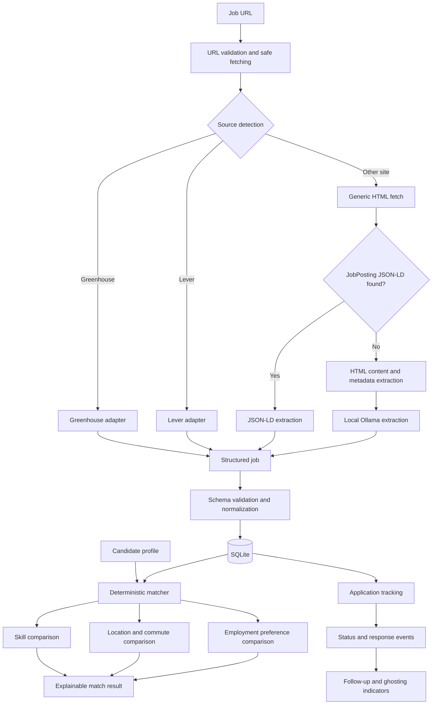

# JobMatch

[](https://github.com/eciile/JobMatch/actions/workflows/ci.yml)


**JobMatch** is a personal job-search assistant that imports job postings from URLs, extracts structured requirements, evaluates how well they match a candidate profile, and tracks applications and recruiter responses.

The project combines deterministic matching logic with local LLM-powered extraction through Ollama. Its goal is to make job searching more structured, explainable, and measurable.

## Current capabilities

### Job import and extraction

* Validate and safely fetch public job-posting URLs
* Detect and extract jobs from Greenhouse and Lever
* Extract `JobPosting` JSON-LD when available
* Fall back to generic HTML extraction for unsupported sites
* Use a local Ollama model to normalize unstructured job content
* Persist imported jobs in SQLite
* Prevent duplicate imports using normalized source URLs

Extracted information includes:

* Job title
* Company
* Location
* Description
* Employment type
* Required and preferred skills
* Qualifications
* Soft skills
* Languages
* Posting and expiration dates
* Application URL

### Candidate profile

JobMatch stores one local candidate profile containing:

* Skills
* Languages
* Current location
* Preferred locations
* Preferred employment types
* Geographic coordinates
* Maximum commute distance

### Explainable job matching

The matching engine is deterministic and returns:

* Overall score from 0 to 100
* Recommendation level
* Matching required skills
* Missing required skills
* Matching preferred skills
* Missing preferred skills
* Location compatibility
* Employment-type compatibility
* Per-category score breakdown

Location matching follows this order:

1. Remote-work compatibility
2. Geodesic distance when coordinates are available
3. Normalized text comparison
4. Unknown result when location data is unusable

Missing job information is excluded from the scoring denominator instead of automatically penalizing the candidate.

### Application tracking

JobMatch can track one application per imported job.

Supported information includes:

* Current application status
* Application date
* Planned follow-up date
* Next action
* Notes
* Last employer response
* Application event history
* Most recent completed follow-up
* Days without a response
* Provisional possible-ghosting indicator

Application events can represent:

* Status changes
* Applications
* Follow-ups
* Employer responses
* Interviews
* Offers
* Rejections
* Notes

The current ghosting indicator uses a provisional 21-day threshold. Future versions will replace this fixed rule with statistics learned from application history.

## Architecture



## Technology stack

* **API:** FastAPI
* **Validation:** Pydantic
* **Database:** SQLite
* **ORM:** SQLAlchemy
* **Migrations:** Alembic
* **HTTP:** HTTPX
* **HTML parsing:** Beautiful Soup and Trafilatura
* **Local LLM:** Ollama
* **Distance calculation:** geopy
* **Testing:** pytest
* **CI:** GitHub Actions

## Requirements

* Python 3.11 or newer
* Git
* Ollama
* A locally installed Ollama model

## Getting started

### 1. Clone the repository

```bash
git clone https://github.com/eciile/JobMatch.git
cd JobMatch
```

### 2. Create a virtual environment

#### Windows PowerShell

```powershell
python -m venv .venv
.venv\Scripts\Activate.ps1
```

#### macOS or Linux

```bash
python -m venv .venv
source .venv/bin/activate
```

### 3. Install dependencies

```bash
python -m pip install --upgrade pip
python -m pip install -r requirements.txt
```

### 4. Configure the environment

Copy the example environment file:

#### Windows PowerShell

```powershell
Copy-Item .env.example .env
```

#### macOS or Linux

```bash
cp .env.example .env
```

Example configuration:

```env
OLLAMA_HOST=http://127.0.0.1:11434
OLLAMA_MODEL=qwen3:4b-instruct-2507-q4_K_M
OLLAMA_TIMEOUT_SECONDS=300
```

The model name can be replaced with another Ollama model that supports structured output.

### 5. Install the configured Ollama model

```bash
ollama pull qwen3:4b-instruct-2507-q4_K_M
```

Confirm that Ollama is running:

```bash
ollama list
```

### 6. Apply database migrations

```bash
python -m alembic upgrade head
```

### 7. Start the API

```bash
python -m uvicorn app.main:app --reload
```

The API will be available at:

```text
http://127.0.0.1:8000
```

Interactive API documentation:

```text
http://127.0.0.1:8000/docs
```

Alternative ReDoc documentation:

```text
http://127.0.0.1:8000/redoc
```

## Main API endpoints

| Method | Endpoint                            | Description                            |
| ------ | ----------------------------------- | -------------------------------------- |
| `GET`  | `/health`                           | Check API health                       |
| `POST` | `/jobs/validate`                    | Validate a job URL                     |
| `POST` | `/jobs/fetch`                       | Safely fetch a job page                |
| `POST` | `/jobs/extract`                     | Extract a job without saving it        |
| `POST` | `/jobs/import`                      | Extract and persist a job              |
| `GET`  | `/jobs`                             | List imported jobs                     |
| `GET`  | `/profile`                          | Retrieve the candidate profile         |
| `PUT`  | `/profile`                          | Create or update the candidate profile |
| `POST` | `/jobs/{job_id}/match`              | Match a job against the profile        |
| `PUT`  | `/jobs/{job_id}/application`        | Create or update application tracking  |
| `GET`  | `/jobs/{job_id}/application`        | Retrieve application details           |
| `POST` | `/jobs/{job_id}/application/events` | Record an application event            |
| `GET`  | `/applications`                     | List tracked applications              |

## Example workflow

### Import a job

```bash
curl -X POST "http://127.0.0.1:8000/jobs/import" \
  -H "Content-Type: application/json" \
  -d '{"url":"https://example.com/jobs/123"}'
```

### Create or update the candidate profile

```bash
curl -X PUT "http://127.0.0.1:8000/profile" \
  -H "Content-Type: application/json" \
  -d '{
    "full_name": "Example Candidate",
    "headline": "Junior AI Engineer",
    "location": "Cesson-Sévigné, France",
    "latitude": 48.121,
    "longitude": -1.603,
    "max_commute_distance_km": 30,
    "years_of_experience": 2,
    "skills": [
      "Python",
      "PyTorch",
      "FastAPI",
      "LLM Engineering"
    ],
    "languages": [
      {
        "name": "English",
        "level": "Professional"
      },
      {
        "name": "French",
        "level": "Professional"
      }
    ],
    "preferred_locations": [
      "Rennes",
      "Remote"
    ],
    "preferred_employment_types": [
      "PERMANENT"
    ]
  }'
```

### Calculate a match

```bash
curl -X POST "http://127.0.0.1:8000/jobs/1/match"
```

Example response:

```json
{
  "job_id": 1,
  "profile_id": 1,
  "score": 78,
  "recommendation": "good_match",
  "matching_required_skills": [
    "Python"
  ],
  "missing_required_skills": [
    "AWS Bedrock"
  ],
  "location_match": true,
  "location_distance_km": 7.2,
  "maximum_commute_distance_km": 30,
  "location_match_method": "distance",
  "employment_type_match": true
}
```

### Track an application

```bash
curl -X PUT "http://127.0.0.1:8000/jobs/1/application" \
  -H "Content-Type: application/json" \
  -d '{
    "status": "applied",
    "applied_at": "2026-08-04",
    "follow_up_at": "2026-08-18",
    "next_action": "Follow up with the recruiter",
    "notes": "Applied through the company website"
  }'
```

### Record an employer response

```bash
curl -X POST "http://127.0.0.1:8000/jobs/1/application/events" \
  -H "Content-Type: application/json" \
  -d '{
    "event_type": "employer_response",
    "notes": "Recruiter requested interview availability"
  }'
```

## Testing

Run the complete test suite:

```bash
python -m pytest -q
```

Compile the application and test files:

```bash
python -m compileall app tests
```

Verify migrations:

```bash
python -m alembic upgrade head
python -m alembic current
```

## Continuous integration

GitHub Actions runs automatically for pushes and pull requests targeting `main`.

The CI workflow:

1. Installs Python 3.11
2. Installs project dependencies
3. Applies all Alembic migrations
4. Runs the pytest suite
5. Compiles the Python source files

## Project structure

```text
JobMatch/
├── .github/
│   └── workflows/
│       └── ci.yml
├── app/
│   ├── services/
│   │   ├── application_tracking.py
│   │   ├── generic_html_extractor.py
│   │   ├── geocoding.py
│   │   ├── job_matcher.py
│   │   ├── job_page_fetcher.py
│   │   ├── job_sources.py
│   │   ├── jsonld_extractor.py
│   │   ├── llm_job_extractor.py
│   │   └── url_security.py
│   ├── config.py
│   ├── database.py
│   ├── main.py
│   ├── models.py
│   └── schemas.py
├── migrations/
├── tests/
├── .env.example
├── alembic.ini
├── pyproject.toml
├── requirements.txt
└── README.md
```

## Design principles

### Deterministic decisions

The LLM extracts and normalizes information, but it does not directly decide the final job-match score. Scoring is calculated with deterministic Python logic.

### Explainability

Match responses include the evidence behind the score instead of returning only a number.

### Local-first AI

Job extraction can run through a local Ollama model, keeping the workflow usable without requiring a paid hosted LLM API.

### Evidence before inference

Application events are stored as objective history. Possible ghosting is computed separately and does not overwrite the actual application status.

## Current limitations

* Skill matching currently relies on normalized exact matches and explicit aliases.
* Broad semantic skill similarity is not implemented yet.
* LLM extraction accuracy depends on the selected local model and source-page quality.
* Some job sites rely heavily on JavaScript and may expose incomplete server-side HTML.
* The ghosting indicator currently uses a provisional fixed threshold.
* The project currently provides an API; a graphical interface is planned.
* Public production deployment and continuous delivery are not implemented yet.

## Roadmap

* Web dashboard for job import, matching, and application tracking
* Improved candidate-profile management
* Semantic skill matching using embeddings
* Historical response-rate and ghosting analytics
* Kaplan–Meier-style response-time estimates
* Job scam-risk signals
* Skill-frequency and learning-gap analytics
* Docker-based local setup
* Production database support
* Staging deployment and GitHub Actions CD

## Project status

JobMatch is under active development.

The current backend MVP supports the complete core workflow:

```text
Import a job
→ Extract structured requirements
→ Compare it with a candidate profile
→ Explain the match
→ Track the application
→ Record follow-ups and employer responses
```

## Author

Created by [eciile](https://github.com/eciile).

